# Bug — guion de la presentación

> Esta es la versión **legible** de la presentación: lo mismo que sale proyectado, pero en texto y
> con las imágenes enlazadas, para revisarla en GitHub o repasarla antes de defender.
>
> - **Para proyectar:** `docs/vv/presentacion.html` — se mueve con ← → y la barra espaciadora.
> - **Para imprimir o enviar:** `docs/vv/presentacion.pdf` — una página por diapositiva.
> - **Para regenerar las dos:** `npm run vv:presentacion` (los números salen de los artefactos de la
>   última ejecución, no están escritos a mano).
>
> El recorrido son tres actos: **el juego** → **cómo está hecho** → **cómo se prueba y con qué**.

---

## 1 · Portada

# Bug.

Un juego de cartas donde la partida vive en los navegadores de quienes juegan. **No hay servidor de
juego.** Nadie tiene la versión buena del estado: o están todos de acuerdo, o no hay partida.

| Primero | Después | Y el grueso |
|---|---|---|
| Qué es y cómo se juega | Cómo está hecho | Cómo se prueba, y con qué |

---

# Acto I — El juego

*Qué es, con qué cartas se juega y cómo entra alguien que pasa por el stand.*

## 3 · Un UNO con temática de desgracias informáticas

Mismo flujo que el juego de cartas de toda la vida: te reparten **7 cartas**, juegas una que
**iguale en color, número o símbolo**, y si no puedes, robas. **Gana quien se queda sin cartas.**

Lo que cambia es el disfraz — y algunas mecánicas propias. Aquí no hay un «+2»: hay un *Update de
Windows*. No hay «salta»: se te *fue el WiFi*.

Entre **2 y 10 jugadores**, 30 segundos por turno, y se entra escaneando un QR desde el móvil sin
instalar nada.

Los cuatro palos sustituyen a los colores:

| Palo | Símbolo | |
|---|---|---|
| **Código** | `{ }` | el palo verde |
| **Hardware** | 💻 | el palo magenta |
| **Internet** | 📶 | el palo violeta |
| **Café** | ☕ | el palo rosa |

El arte es propio: las cartas están dibujadas en Inkscape y compiladas a un sprite que viaja dentro
del HTML, así que están pintadas desde el primer fotograma.

## 4 · Las de siempre, con otro nombre

| Carta clásica | En Bug | Qué hace |
|---|---|---|
| salta | **Se fue el WiFi** | El siguiente pierde el turno |
| reversa | **Ctrl+Z** | La ronda cambia de sentido |
| +2 / +4 | **Update de Windows** | El siguiente roba y calla |
| comodín | **Reinicio de Router** | Se juega sobre cualquier cosa y eliges palo |
| comodín +4 | **Pantalla Azul (BSOD)** | Lo mismo, y el siguiente roba cuatro |

Solo los dos comodines van **sin palo**, y se pintan con las cuatro franjas de color: es exactamente
lo que significa «no soy de ningún palo».

> Un detalle que costó un rato entender jugando: un comodín en el pozo **no dice a qué hay que
> igualar**. Por eso la carta gira en 3D y aterriza teñida del palo que eligió quien la tiró.

## 5 · Cartas de Caos — lo que Bug añade

Cuatro mecánicas que el UNO original no tiene:

| Carta | Tipo | Qué hace |
|---|---|---|
| **Copiar y Pegar** | interrupción | Se juega **fuera de tu turno** si tienes la carta gemela de la del pozo. Corta la ronda y el turno salta a ti |
| **Apagar y volver a prender** | reinicio | Tiras el pozo y pones una carta tuya de base. La partida sigue con ese palo |
| **Derrame de Café** | barajado | Todos pasan su mano al siguiente. Tu buena mano deja de ser tuya |
| **Virus Troyano** | ataque | Eliges víctima y le regalas dos cartas tuyas. Cuidado: puede dejarte sin mano |

**Copiar y Pegar** es la que más se nota en el diseño distribuido: es una jugada que llega *fuera de
turno* y desde otro nodo, así que dos personas pueden intentar cortar a la vez. Quién gana no lo
decide un servidor — lo decide el reloj lógico, y sale igual en las tres pantallas.

## 6 · Del QR a la primera carta, sin instalar nada

1. **Uno hace de anfitrión** y levanta la imagen: `docker run -p 7787:7787 sketox/bug`. Un solo puerto.
2. Escribe su nombre, pulsa **Crear sala** y aparece un **código de 4 caracteres** y un **QR**.
3. Los demás **escanean el QR** desde su móvil. El enlace ya lleva dentro la sala y el punto de
   encuentro: solo ponen su nombre.
4. Con 2 o más en el lobby, el anfitrión pulsa **¡Empezar!** — y quién abre lo decide la semilla, no él.
5. Se juega. <kbd>M</kbd> abre la **Pantalla Maestra** para el proyector.

> **Requisito de feria:** «el público debe poder interactuar de forma inmediata, escaneando un QR,
> sin instalar aplicaciones». Por eso el QR transporta **sala + señalización**: quien lo escanea no
> configura nada. Y si el QR apunta a `localhost`, la propia pantalla lo avisa — solo funcionaría en
> esa máquina.

Durante la partida: 30 s por turno · recargar la página **no te echa**, vuelves con tu mano · si a
alguien se le cae la conexión le guardan el sitio y le saltan el turno.

## 7 · La entrada y la pantalla de reglas

| | |
|---|---|
| 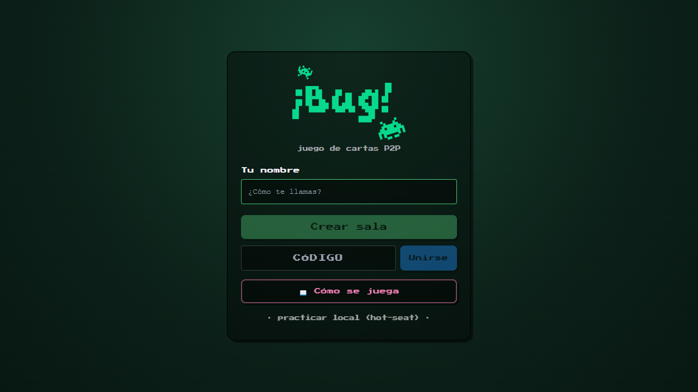 | 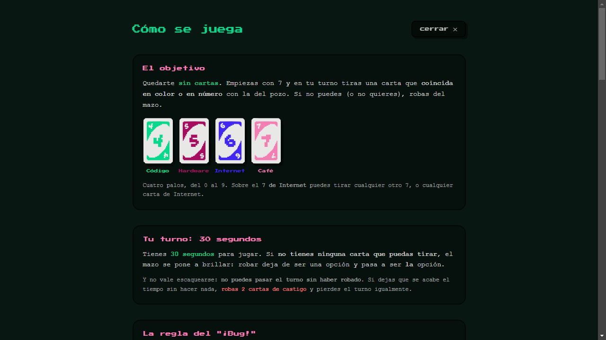 |
| La entrada: nombre, crear o unirse, y practicar en local | «Cómo se juega», con las cartas de verdad: se aprende sin que nadie lo explique |

## 8 · La mesa, y cómo se ve en un móvil

| | |
|---|---|
| 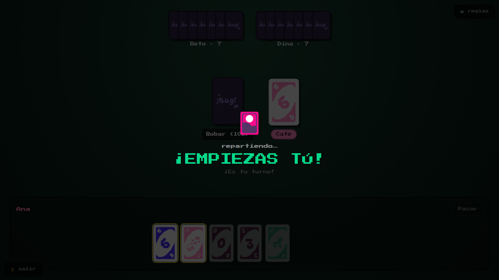 | 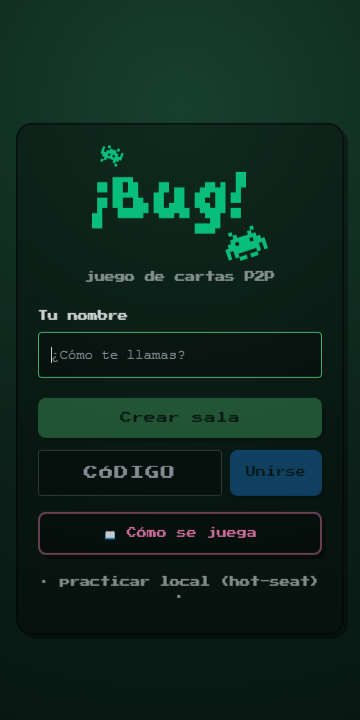 |
| Mesa repartida: siete cartas, mazo, pozo y de quién es el turno | 360 px: la anchura desde la que llega casi todo el mundo en la feria |

## 9 · Cómo se acaba

| | |
|---|---|
| 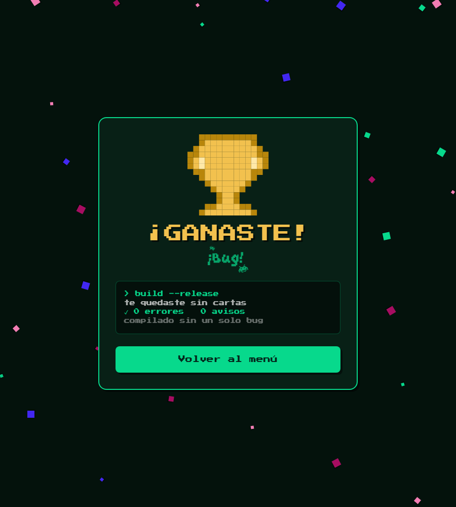 | 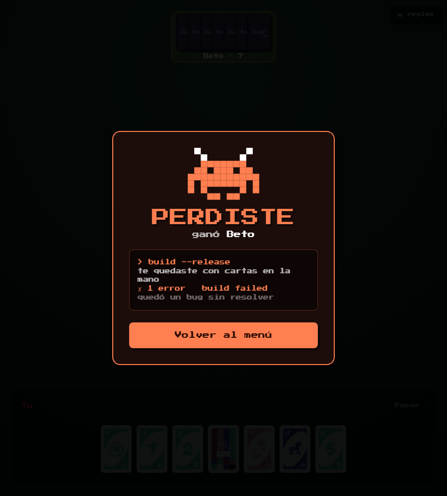 |
| Ganar es compilar sin errores: copa, confeti y `✓ 0 errores` | Perder es que falle la compilación: el bicho, y `✗ build failed` |

Las dos pantallas usan **la misma metáfora leída al derecho y al revés**, y por eso se entienden sin
explicarlas. Antes perder mostraba una pantalla azul — la misma cara que la **carta** «Pantalla Azul
de la Muerte», que tiene su propio efecto al jugarse. Dos mensajes muy distintos con la misma
imagen: al verla se entendía que el juego se había roto.

---

# Acto II — Cómo está hecho

*Dónde corre el juego de verdad, y qué lo mantiene de acuerdo sin un árbitro.*

## 11 · Cada navegador es jugador y servidor a la vez

**Abre tú el acto con esta.** Es la idea de la que cuelga todo lo demás.

> «En un juego normal hay un ordenador central con la partida dentro, y los demás le preguntan. Aquí
> ese ordenador **no existe**. Cada navegador tiene el juego entero —las reglas, el mazo y su propia
> copia de la partida— y las jugadas van directas de uno a otro.»

El dibujo: cuatro navegadores unidos todos con todos. **6 conexiones** entre cuatro; con diez
jugadores, **45**. No hace falta explicar la fórmula, basta con enseñar que crece.

**El remate, que es el que se recuerda:** *apaga el ordenador del que organizó la partida y los demás
siguen jugando.* Si alguien duda de que sea P2P, esa frase lo zanja.

## 12 · «Si hay un contenedor encendido, ¿esto no es cliente-servidor?»

**Esta pregunta cae siempre.** Por eso está puesta como titular: la haces tú antes de que la hagan.

El dibujo lo dice todo y puedes recorrerlo con el dedo:

1. Arriba, el servidor. Dos flechas **de puntos** bajando: *«te presento a Beto»*.
2. Abajo, los dos navegadores unidos por una línea **gruesa y continua**: por ahí van las cartas.
3. Las puntitas son el saludo; la línea gorda es la partida. **El servidor no toca la línea gorda.**

> «Es el portero del edificio, no el árbitro de la partida. Presenta, y se aparta.»

La tabla de la derecha está para que la leas de una en una si preguntan: el contenedor no tiene el
motor de reglas, no guarda el estado, no ve las cartas, no decide el turno y **ni siquiera aparece**
en la Pantalla Maestra, porque no es un nodo.

**Si te aprietan:** empezamos una partida entre tres y apagamos Docker a la mitad. La partida sigue.
Lo único que deja de funcionar es que entren jugadores nuevos.

## 13 · Tres razones para quitar el servidor de en medio

La justificación, en tres tarjetas. Una frase por tarjeta y ya está:

1. **Lo pedía el trabajo.** Es un proyecto de Sistemas Distribuidos: poner un servidor que lo decida
   todo habría sido esquivar justo lo que hay que demostrar.
2. **Privacidad.** Las cartas no pasan por ningún intermediario, así que no hay dónde espiarlas —y
   no es una promesa: nos sentamos en medio con un proxy y no se ve ni una jugada (lámina de Burp).
3. **Aguanta más.** No hay servidor que pagar ni que se caiga.

**La pregunta que viene detrás —«¿y entonces por qué hay un servidor?»— también está contestada en
la lámina:** porque dos navegadores no pueden encontrarse solos, alguien tiene que presentarlos, y
eso le pasa a *todos* los sistemas de este tipo (BitTorrent, Bitcoin, IPFS). Lo que se elige es qué
pasa **después**; y aquí, después, sobra.

Cierra con el precio, que enlaza con la siguiente: *todo lo que un servidor te daba gratis hay que
resolverlo entre iguales*.

## 14 · Cuatro acuerdos, y ningún jefe

**No hace falta que te sepas la teoría.** Cada tarjeta se lee sola, y el nombre técnico va en
pequeño debajo por si preguntan. Léelas en este orden:

| Lo que dices | Si preguntan el término |
|---|---|
| **El turno.** Solo juega quien tiene el testigo; al terminar se lo pasa al siguiente. Así nadie juega dos veces ni dos a la vez | exclusión mutua · paso de testigo |
| **El orden.** Cada jugada lleva un número que crece. Si dos llegan cruzadas, todos las ordenan igual: por el número, y si empatan, por el nombre | relojes de Lamport |
| **La copia.** Todos barajan el mismo mazo desde un número inicial compartido, y cada uno publica una huella de su partida. Huellas iguales = están viendo lo mismo | estado replicado · *hash* |
| **Las caídas.** Cada jugador dice «sigo aquí» cada poco. Si calla 2,5 s se sospecha; a los 6 s se le da por caído y, si era el que coordinaba, se elige otro | latidos · elección de líder (Bully) |

**El remate es lo mejor de la lámina:** si a alguien se le pierde una jugada, lo descubre **él solo**
porque su huella deja de coincidir; pide la partida entera y la adopta. Se arregla en vivo.

> Truco por si te preguntan algo que no sepas: todo esto se **ve** en la lámina siguiente. «Te lo
> enseño» es una respuesta perfectamente válida.

## 15 · Qué dice cada cosa de la malla

La Pantalla Maestra con **una burbuja por cada cosa**, y una línea a su sitio exacto. No tienes que
señalar con el dedo ni recordar el orden: se lee sola.

- **Líder** — quien coordina ahora mismo. Ojo, *no manda en el juego*: solo desempata si alguien se cae.
- **Testigo** — quién puede jugar en este instante.
- **Convergencia** — ¿están todos viendo la misma partida?
- **La huella** — el resumen de la partida de cada uno. **Las tres iguales = los tres de acuerdo.**
- **Sucesos** — quién se cayó, quién tomó el mando, qué se reparó.

Se abre con la tecla <kbd>M</kbd> **durante la partida**, así que en la feria puedes enseñarla en
vivo mientras alguien juega. Es la lámina que convierte «esto es distribuido» en algo que se ve.

# Acto III — Cómo se prueba

*Qué herramienta para qué pregunta — y qué encontró cada una.*

## 17 · ¿Cómo compruebas quién tiene razón si nadie manda?

En una aplicación con backend, comprobar el estado es fácil: se le pregunta a la base de datos. Aquí
**no hay a quién preguntar**. Hay tres réplicas y ninguna manda.

Por eso la pregunta central no es *¿está bien construido?* (verificación) ni *¿sirve para lo que se
pidió?* (validación), sino una tercera: **¿siguen todos de acuerdo?**

Y dos agravantes:

- **Lo que no existe en Node.** `RTCPeerConnection` no existe fuera de un navegador. La malla de
  verdad **solo** se puede probar en uno.
- **Lo que no se repite.** Un evento que llega tarde, un nodo que cae a media elección, dos jugadas
  en el mismo milisegundo. No se reproducen a mano: hay que **provocarlos**.

## 18 · Cinco formas de probar, cada una para algo distinto

| Capa | Nº |
|---|---|
| Vitest (unitarias) | 190 |
| Cypress (navegador) | 22 |
| Seguridad (ataques) | 11 |
| Validación distribuida | 7 |
| **Total** | **230** |

La pirámide es ancha por abajo —190 unitarias sostienen el motor y los algoritmos— pero también
**ancha por arriba**, y eso no es doctrina: es lo que dijeron los defectos. De los 17 encontrados,
**11 eran invisibles para una prueba unitaria**.

## 19 · SonarQube — el corrector ortográfico del código

Es **el corrector ortográfico del código**: lo lee entero y señala lo que está mal escrito, sin
necesidad de ejecutar nada.

Hace falta porque una prueba solo puede juzgar *lo que llega a ejecutar*. Esto lee **también lo que
todavía no usa nadie**, y responde a preguntas que las pruebas ni se plantean: ¿hemos copiado y
pegado código? ¿hay alguna parte que ya nadie entiende? ¿estamos probando más que el mes pasado, o
menos?

Se analiza el monorepo **como un solo proyecto** y no como cuatro: los cuatro paquetes se despliegan
juntos, así que la duplicación entre `engine` y `net` es duplicación de verdad y queremos verla.

| Métrica | Valor |
|---|---|
| Quality gate | **Passed** |
| Bugs | **0** (fiabilidad A) |
| Cobertura | **89 %** (100 % en código nuevo) |
| Duplicación | **1,3 %** (umbral < 3 %) |
| engine · net · signaling | 93,1 % · 98,1 % · 83,0 % |

## 20 · Evidencia: el panel de SonarQube

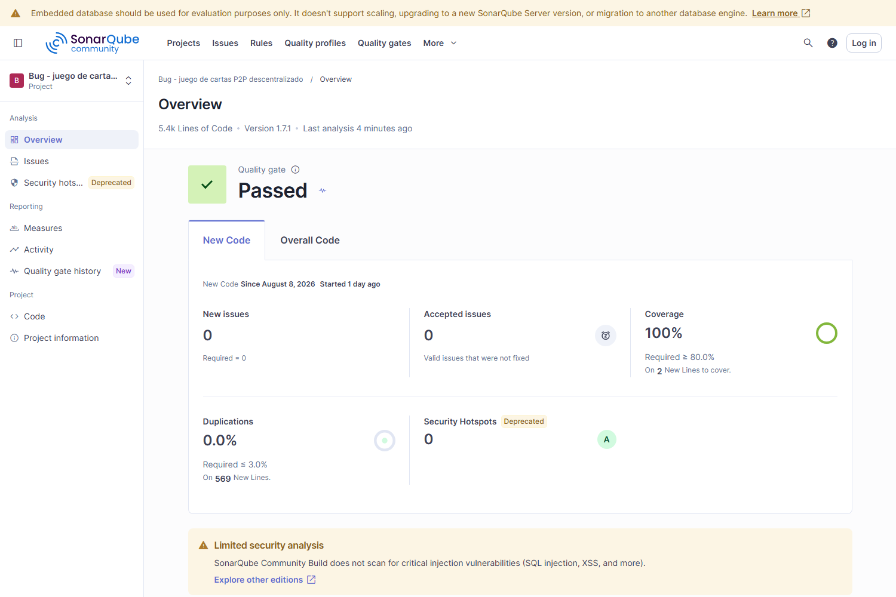

## 21 · Encontró 23 avisos. Los miramos uno a uno.

**1 bug · accesibilidad.** El fondo del diálogo de jugada cerraba con ratón y **no con teclado**. Los
dos parches evidentes fallaron: un `onKeyDown` en un `div` sin foco no se dispara nunca, y
`role="presentation"` cambiaba una queja por dos. La señal era que el elemento era el equivocado:
ahora es un `<dialog>` nativo, que trae hecho <kbd>Esc</kbd>, foco atrapado y backdrop.

**22 avisos · todos la misma regla.** `Math.random`. Revisados uno a uno: 16 son partículas de
efectos visuales, el resto códigos de sala y semillas **públicos por diseño**. El único que merecía
dudar: `uid()`, que genera el secreto de reconexión — sus dos ramas reales usan `crypto`. **0
explotables.**

> Y dos incidencias quedaron marcadas como **falso positivo, con la justificación escrita en la
> herramienta**: el analizador cree que un `<dialog>` no es interactivo. Gestionar hallazgos incluye
> decidir cuáles no son defectos — lo que no se puede es dejarlos sin mirar.

**Y el panel del repositorio entero.** Marcaba una D en fiabilidad, así que fuimos a ver de qué
estaba hecha: **28 de sus 37 avisos eran una sola regla** —botones sin declarar `type`, que por
defecto es `submit`—, más 21 componentes que no marcaban sus props como `Readonly`. Corregidos los
49. Una sola regla se apagó, con la justificación escrita en `sonar-project.properties`: la que
busca comentarios `TODO` daba 13 avisos y **los 13 eran la palabra castellana «todo»** («todo el
estado se deriva de una semilla», «la imagen todo-en-uno»). Una regla que en este código no puede
acertar nunca no protege de nada: solo enseña a mirar el panel por encima.

**Y dos avisos que parecían cosméticos acabaron en código más duro.** El código de sala y la
semilla salían de `Math.random`. No son secretos —el código se enseña en pantalla—, pero **publican
salidas del mismo generador que los produce**, y el de V8 es un *xorshift128+*: su estado se
reconstruye viendo unas pocas. Llevado al extremo, alguien de tu sala podría predecir el código de
la siguiente que crearas. Riesgo **bajo**, coste de arreglarlo **ridículo**: ahora salen de
`crypto`, con muestreo sin sesgo y cuatro pruebas. Y el túnel del contenedor buscaba su ejecutable
por `PATH`; ahora usa la ruta absoluta que fija el propio Dockerfile.

Si te preguntan por qué quedan 17 avisos de esa misma regla sin tocar: 15 colocan partículas de un
efecto visual y 2 **son** la rama de respaldo para navegadores sin criptografía. Están excluidos con
la razón escrita en `sonar-project.properties` — en el repositorio, no en un clic del panel.

> Conviene tener claro qué mide cada pestaña: el **quality gate** juzga el **código nuevo** (*clean
> as you code*) y está en verde; **Overall Code** acumula el repositorio entero, pruebas y
> utilidades de V&V incluidas.

## 22 · Jenkins — un ayudante que lo comprueba todo, solo

Cada vez que alguien toca una línea, este ayudante **vuelve a pasar las 230 comprobaciones** por su
cuenta. Nadie se lo pide.

Hace falta porque las pruebas solo sirven si alguien las corre — y si depende de que uno se acuerde,
se acaban corriendo cuando ya se sospecha algo. Así, romper el juego y enterarse tarde **deja de ser
posible**: se sabe en minutos. Y hay algo que solo da esto: probar **en un ordenador que no es el
nuestro**.

| Etapa | 1 | 2 | 3 | 4 | 5 | 6 | 7 |
|---|---|---|---|---|---|---|---|
| | Dependencias | Tipos | Pruebas + cobertura | Build | SonarQube | Seguridad | Validación distribuida |

Ordenadas por **lo que falla más barato primero**. Resultado: **SUCCESS**, 7,2 min, disparo por
commit, configuración como código.

## 23 · Evidencia: la construcción en verde

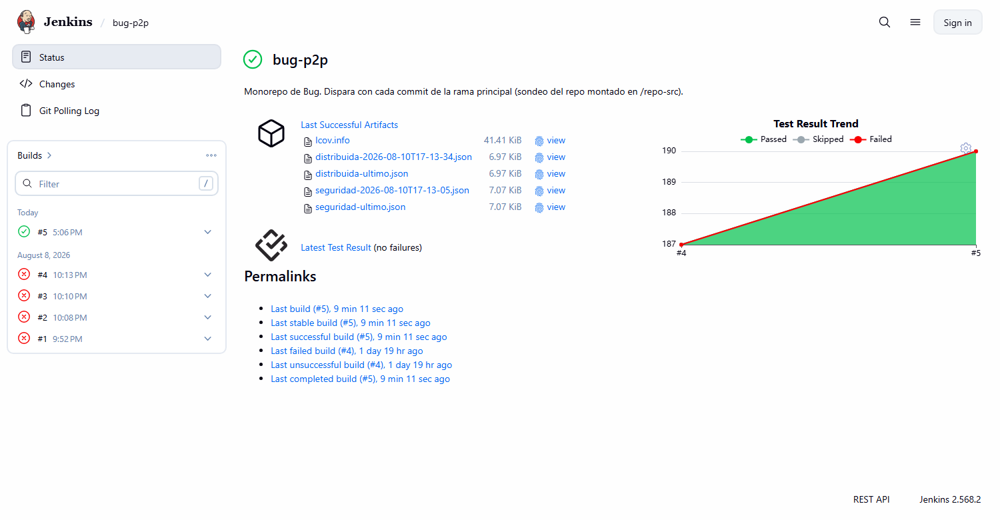

El historial cuenta la verdad: **#1 a #4 en rojo** son el laboratorio que no arrancaba; **#5 es el
primer verde**, y lo disparó un commit — no una persona.

## 24 · Estaba escrito desde hacía semanas. No había arrancado ni una vez.

1. **Jenkins no arrancaba.** El Job DSL dinámico (`scmGit { remotes }`) ya no existe en las versiones
   de hoy: se llevaba por delante a Configuration-as-Code y el contenedor moría en `Exited (5)`.
2. **La corrección no llegaba.** `casc.yaml` vivía dentro de `/var/jenkins_home`, que es un volumen:
   ahí manda el volumen, no la imagen. Reconstruir no cambiaba nada.
3. **El checkout moría.** El plugin de Git no clona rutas locales sin habilitarlo explícitamente.
4. **Y moría otra vez, un paso más adentro.** Git rechazaba el repo montado por pertenecer a otro
   usuario. El mismo error del punto 2 con otro disfraz: `--global` escribe en `$HOME`… que es el volumen.

> Y uno silencioso, el peor: el token de Sonar nunca entraba en el contenedor, así que el pipeline
> habría saltado el análisis en cada build **con el mismo amarillo que si el laboratorio estuviera
> apagado**. Un fallo disfrazado de comportamiento tolerado no lo investiga nadie.

## 25 · Cypress — un jugador de mentira que juega solo

Un robot que **juega como jugaría una persona**: escribe su nombre, pulsa «crear sala», mira sus
cartas y tira una. Y hace algo que una persona no puede: abrir **tres jugadores a la vez** y
comprobar, después de cada jugada, que los tres están viendo exactamente la misma partida.

Se eligió Cypress y no Selenium por una necesidad concreta: para afirmar que **tres réplicas
convergieron** hay que leer la huella de estado de cada nodo — un objeto vivo en la memoria de la
página.

- Cypress se ejecuta **en el mismo bucle de eventos que la aplicación**: entra en `window` y compara
  esas huellas directamente.
- Selenium conduce el navegador *desde fuera*, por el protocolo WebDriver, y todo lo que quiera leer
  tiene que serializarse por ese puente.
- Y los tres nodos son **iframes del mismo origen** en una sola pestaña, con Cypress hablándole a
  cada uno por separado.

| Spec | Casos | Qué cubre |
|---|---|---|
| `menu.cy.ts` | 8 | entrada, QR, validación del enlace, móvil de 360 px |
| `partida-local.cy.ts` | 6 | reparto, robar, no pasar sin robar, rotación del turno |
| `distribuido/malla.cy.ts` | **5** | **tres nodos con WebRTC real**: lobby, convergencia, jugada compartida, Pantalla Maestra y caída |
| `distribuido/aforo.cy.ts` | **3** | **diez nodos**: los diez se ven, la partida arranca con diez, y al once se le dice que no cabe |

## 26 · Evidencia: tres réplicas de acuerdo

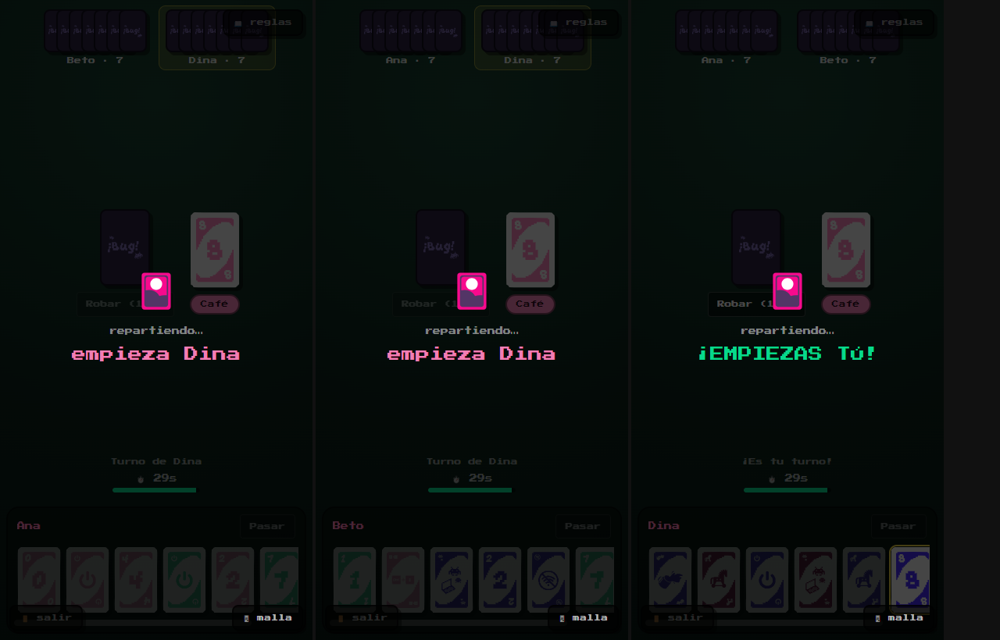

Ana, Beto y Dina · tres contextos de navegación con su propia `RTCPeerConnection` · la prueba compara
sus tres huellas de estado.

## 27 · Evidencia: se cae un nodo y la mesa sigue

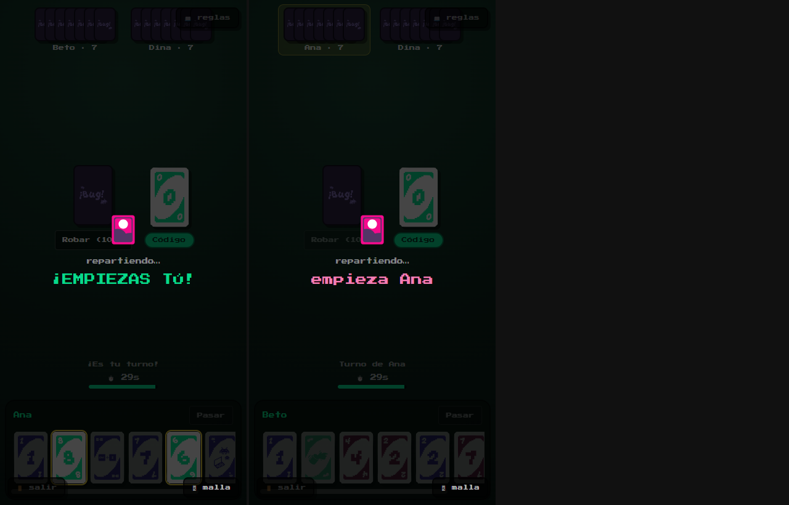

Se quita el tercer nodo de golpe · los dos que quedan siguen convergiendo entre ellos.

## 28 · La mesa llena: diez jugadores y cuarenta y cinco conexiones

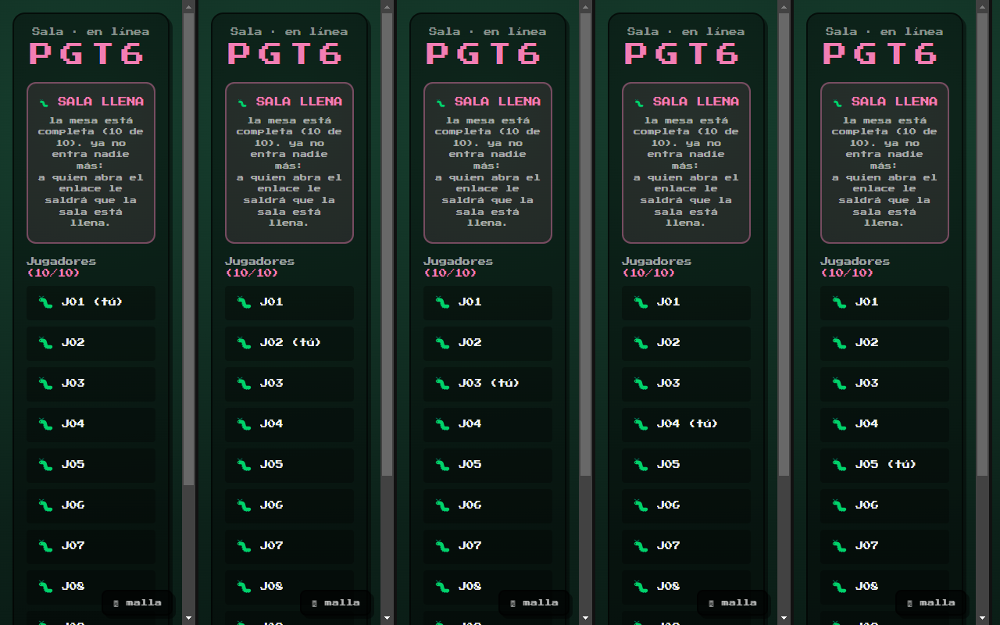

Diez navegadores, cada uno viéndose a sí mismo como «(tú)» y a los otros nueve.

- **Lo que se comprueba:** los diez se ven · la mesa se estabiliza en los diez · la partida arranca y
  **las diez pantallas muestran lo mismo**.
- **El número once:** le sale **«SALA LLENA»** con los diez sitios dibujados, en vez de quedarse
  esperando. Y a los de dentro no les afecta.
- **Lo que se aprendió:** con diez, la mesa **tarda unos segundos en asentarse** — hasta que el
  primer latido de cada uno da la vuelta, algunos ven a otros como dudosos. Luego se calma sola.

> Diez jugadores no son diez conexiones: cada uno abre un canal con cada otro, así que son **45**.
> Es el escenario que se va a dar en la feria si el stand se llena.

## 29 · Burp Suite — atacar el sistema a propósito

Nos sentamos **en medio de la conversación** entre jugadores, cambiamos los mensajes y los
reenviamos. Once trampas distintas.

Hacía falta porque todo lo demás usa el juego *como está previsto*, y quien quiere colarse no hace
eso.

| La trampa que probamos | Antes | Ahora |
|---|---|---|
| Hacerse pasar por otro jugador | ✕ | ✓ |
| Echar a alguien de su propia partida | ✕ | ✓ |
| Tumbar el servidor con un mensaje raro | ✕ | ✓ |
| Meterse en una partida ajena | ✕ | ✓ |
| Saturarlo abriendo miles de conexiones | ✕ | ✓ |
| Mandarle un mensaje de 32 MB | ✕ | ✓ |
| Otras cinco, que ya aguantaba | ✓ | ✓ |

✕ se colaba · ✓ la bloquea · **6 agujeros tapados**

> Las once quedaron **escritas como prueba automática**. Un agujero que solo está en la cabeza de
> quien lo encontró vuelve a abrirse en dos semanas.

## 30 · Evidencia — sentados en medio de la partida

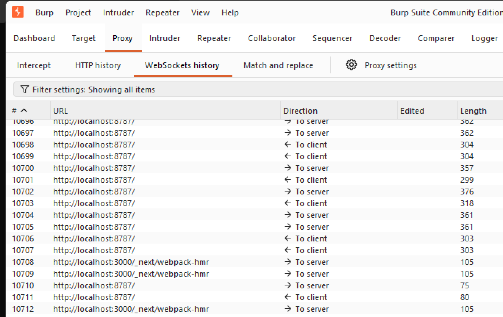

Jugamos una partida entera con Burp de intermediario. Las filas `localhost:8787` son la
**señalización**: los saludos que presentan a los jugadores. Las `webpack-hmr` son el recargador del
servidor de desarrollo, y están a propósito — porque enseñan que ahí aparece **todo** lo que el
proxy vio, y aun así **ni una fila es una jugada**.

> **Cómo defenderla, en una frase:** «Esto es todo lo que un intermediario llega a ver de una
> partida de Bug: los saludos. Ni una carta, ni una mano, ni el mazo — eso va cifrado de navegador a
> navegador y no pasa por ningún servidor. Esa es la diferencia con un juego que tiene servidor de
> partida.»

Se reproduce con `node vv/security/partida-por-burp.mjs`: abre dos navegadores **a través del
proxy** y juega. Hace falta porque todo lo demás excluye `localhost` del proxy y Burp no vería nada.

## 31 · Un mensaje de dos líneas tumbaba el servidor de toda la feria

**1 · Qué mandamos.** Un mensaje normal del juego, pero con **un número donde tenía que ir una
lista**. Desde la consola del navegador: lo puede hacer cualquiera que esté jugando.

**2 · Qué pasaba.** El servidor no sabía qué hacer con eso y **se apagaba entero**. Nadie más podía
entrar a ninguna partida. En una feria, se acabó la demo.

**3 · Cómo se arregló.** Ahora **revisa todo lo que le llega** antes de tocarlo, y lo raro lo tira a
la basura. Y una red de seguridad debajo, por si se nos escapa otro que no imaginamos.

> Las partidas en curso **habrían seguido jugándose igual** — las cartas no pasan por el servidor.
> Pero nadie nuevo habría podido entrar.

## 32 · Un simulador para romper la red a propósito

Jugamos **miles de partidas entre jugadores imaginarios** y, a propósito, hacemos que la red se
porte mal. Después comprobamos que todos acaban viendo lo mismo.

| Lo que provocamos | |
|---|---|
| **retrasamos** | una jugada tarda en llegar y aparece fuera de orden |
| **duplicamos** | la misma jugada llega dos veces |
| **desconectamos** | un jugador desaparece a media partida |
| **corrompemos** | a alguien le cambiamos las cartas a mano |

**Resultado: 7 de 7 propiedades verificadas.** En 200 pases de turno, **ni una vez** lo tuvieron dos
jugadores a la vez. Y al que le cambiamos las cartas se da cuenta solo, **pide la partida entera** y
vuelve a la mesa.

Hubo que escribirlo nosotros: ninguna herramienta que se pueda comprar sabe qué es «el turno de Bug»
ni cuándo dos jugadores están de acuerdo.

## 33 · Los 17 errores que encontramos

**Casi ninguno salió de las pruebas automáticas del principio.** Tres ejemplos de los que
aparecieron jugando:

- **La sala no se creaba.** Pulsabas «Crear sala» y no pasaba nada. Las pruebas daban todo verde: el
  fallo estaba en cómo el navegador monta la pantalla, no en las reglas del juego.
- **Un jugador se quedaba fuera.** Veía otra partida distinta a la de los demás y no podía tirar
  ninguna carta. Le había faltado una jugada por el camino.
- **No cabía en el móvil.** La pantalla de entrada se salía por los lados en un teléfono — que es
  por donde entra casi todo el mundo en la feria.

| De dónde salieron | Nº |
|---|---|
| Jugando | 9 |
| Atacándolo | 5 |
| Montando las pruebas | 3 |

> Por eso no basta con probar el código por dentro: hay que **abrir el juego y jugarlo**, con tres
> jugadores de verdad y en un móvil de verdad.

## 34 · Lo que queda por hacer

- **Probarlo entre dos casas.** Funciona en la misma WiFi y con un túnel. Falta la prueba con dos
  redes distintas de verdad — el código ya está preparado.
- **Diez móviles a la vez.** Está medido con diez jugadores simulados. Falta hacerlo con diez
  teléfonos en la mano.
- **Probar el juego en cada cambio.** Las pruebas del navegador se lanzan a mano; el resto ya se
  lanza solo.

> Saber dónde **no** se ha mirado todavía es parte del trabajo. Lo que no está medido, se dice.

## 35 · Cierre

# Un juego que se sostiene solo, y 230 comprobaciones que lo vigilan

| Calidad del código | Se comprueba solo | Se juega solo | Trampas · desastres |
|---|---|---|---|
| **Passed** · 0 errores · 89 % revisado | **7/7** en cada cambio | **22/22** hasta con 10 jugadores | **11 · 7** bloqueadas · superados |

`github.com/Sketox/Bug-p2p`
