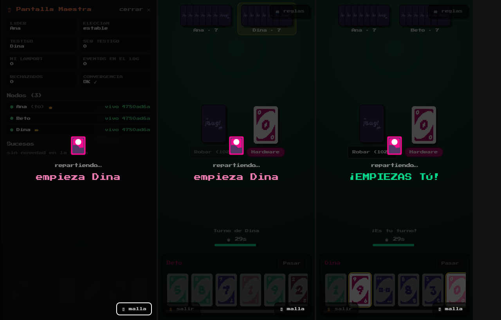

# Bug — guion de la presentación

> Esta es la versión **legible** de la presentación: lo mismo que sale proyectado, pero en texto y
> con las imágenes enlazadas, para revisarla en GitHub o repasarla antes de defender.
>
> - **Para proyectar:** `docs/vv/presentacion.html` — se mueve con ← → y la barra espaciadora.
> - **Para imprimir o enviar:** `docs/vv/presentacion.pdf` — una página por diapositiva.
> - **Para regenerar las dos:** `npm run vv:presentacion` (los números salen de los artefactos de la
>   última ejecución, no están escritos a mano).
>
> El recorrido son tres actos: **el juego** → **cómo está hecho** → **cómo se prueba y con qué**.

---

## 1 · Portada

# Bug.

Un juego de cartas donde la partida vive en los navegadores de quienes juegan. **No hay servidor de
juego.** Nadie tiene la versión buena del estado: o están todos de acuerdo, o no hay partida.

| Primero | Después | Y el grueso |
|---|---|---|
| Qué es y cómo se juega | Cómo está hecho | Cómo se prueba, y con qué |

---

# Acto I — El juego

*Qué es, con qué cartas se juega y cómo entra alguien que pasa por el stand.*

## 3 · Un UNO con temática de desgracias informáticas

Mismo flujo que el juego de cartas de toda la vida: te reparten **7 cartas**, juegas una que
**iguale en color, número o símbolo**, y si no puedes, robas. **Gana quien se queda sin cartas.**

Lo que cambia es el disfraz — y algunas mecánicas propias. Aquí no hay un «+2»: hay un *Update de
Windows*. No hay «salta»: se te *fue el WiFi*.

Entre **2 y 10 jugadores**, 30 segundos por turno, y se entra escaneando un QR desde el móvil sin
instalar nada.

Los cuatro palos sustituyen a los colores:

| Palo | Símbolo | |
|---|---|---|
| **Código** | `{ }` | el palo verde |
| **Hardware** | 💻 | el palo magenta |
| **Internet** | 📶 | el palo violeta |
| **Café** | ☕ | el palo rosa |

El arte es propio: las cartas están dibujadas en Inkscape y compiladas a un sprite que viaja dentro
del HTML, así que están pintadas desde el primer fotograma.

## 4 · Las de siempre, con otro nombre

| Carta clásica | En Bug | Qué hace |
|---|---|---|
| salta | **Se fue el WiFi** | El siguiente pierde el turno |
| reversa | **Ctrl+Z** | La ronda cambia de sentido |
| +2 / +4 | **Update de Windows** | El siguiente roba y calla |
| comodín | **Reinicio de Router** | Se juega sobre cualquier cosa y eliges palo |
| comodín +4 | **Pantalla Azul (BSOD)** | Lo mismo, y el siguiente roba cuatro |

Solo los dos comodines van **sin palo**, y se pintan con las cuatro franjas de color: es exactamente
lo que significa «no soy de ningún palo».

> Un detalle que costó un rato entender jugando: un comodín en el pozo **no dice a qué hay que
> igualar**. Por eso la carta gira en 3D y aterriza teñida del palo que eligió quien la tiró.

## 5 · Cartas de Caos — lo que Bug añade

Cuatro mecánicas que el UNO original no tiene:

| Carta | Tipo | Qué hace |
|---|---|---|
| **Copiar y Pegar** | interrupción | Se juega **fuera de tu turno** si tienes la carta gemela de la del pozo. Corta la ronda y el turno salta a ti |
| **Apagar y volver a prender** | reinicio | Tiras el pozo y pones una carta tuya de base. La partida sigue con ese palo |
| **Derrame de Café** | barajado | Todos pasan su mano al siguiente. Tu buena mano deja de ser tuya |
| **Virus Troyano** | ataque | Eliges víctima y le regalas dos cartas tuyas. Cuidado: puede dejarte sin mano |

**Copiar y Pegar** es la que más se nota en el diseño distribuido: es una jugada que llega *fuera de
turno* y desde otro nodo, así que dos personas pueden intentar cortar a la vez. Quién gana no lo
decide un servidor — lo decide el reloj lógico, y sale igual en las tres pantallas.

## 6 · Del QR a la primera carta, sin instalar nada

1. **Uno hace de anfitrión** y levanta la imagen: `docker run -p 7787:7787 sketox/bug`. Un solo puerto.
2. Escribe su nombre, pulsa **Crear sala** y aparece un **código de 4 caracteres** y un **QR**.
3. Los demás **escanean el QR** desde su móvil. El enlace ya lleva dentro la sala y el punto de
   encuentro: solo ponen su nombre.
4. Con 2 o más en el lobby, el anfitrión pulsa **¡Empezar!** — y quién abre lo decide la semilla, no él.
5. Se juega. <kbd>M</kbd> abre la **Pantalla Maestra** para el proyector.

> **Requisito de feria:** «el público debe poder interactuar de forma inmediata, escaneando un QR,
> sin instalar aplicaciones». Por eso el QR transporta **sala + señalización**: quien lo escanea no
> configura nada. Y si el QR apunta a `localhost`, la propia pantalla lo avisa — solo funcionaría en
> esa máquina.

Durante la partida: 30 s por turno · recargar la página **no te echa**, vuelves con tu mano · si a
alguien se le cae la conexión le guardan el sitio y le saltan el turno.

## 7 · La entrada y la pantalla de reglas

| | |
|---|---|
|  |  |
| La entrada: nombre, crear o unirse, y practicar en local | «Cómo se juega», con las cartas de verdad: se aprende sin que nadie lo explique |

## 8 · La mesa, y cómo se ve en un móvil

| | |
|---|---|
|  |  |
| Mesa repartida: siete cartas, mazo, pozo y de quién es el turno | 360 px: la anchura desde la que llega casi todo el mundo en la feria |

---

# Acto II — Cómo está hecho

*Dónde corre el juego de verdad, y qué lo mantiene de acuerdo sin un árbitro.*

## 10 · «Si hay un contenedor encendido, ¿esto no es cliente-servidor?»

El contenedor **reparte el programa y presenta a los jugadores**. El juego **corre entero dentro de
cada navegador**.

Cuando alguien abre el enlace, su navegador *se descarga una copia del programa* — como bajarse un
PDF. Esa copia se ejecuta en su máquina, con el motor de reglas completo y su propia réplica del
estado. El contenedor solo los presenta; a partir de ahí, se aparta.

| | El contenedor | Tu navegador |
|---|---|---|
| ¿Tiene el motor de reglas? | No | **Sí, entero** |
| ¿Guarda el estado? | No | **Su propia réplica** |
| ¿Ve las cartas? | **Nunca** | Las suyas |
| ¿Decide el turno? | No | El testigo, entre navegadores |
| ¿Sale en la Pantalla Maestra? | **No aparece** | Sí, como nodo |

> **Es el portero del edificio, no el árbitro de la partida.**

**La demo que lo demuestra:** empezar una partida entre tres y apagar Docker a la mitad. La partida
sigue. Solo dejan de poder entrar los nuevos.

## 11 · El WebSocket presenta. El juego va por WebRTC.

**Arranque · WebSocket.** Dos navegadores **no pueden encontrarse solos**: no tienen IP pública ni
escuchan conexiones entrantes. Alguien tiene que presentarlos. Eso —y solo eso— hace el servidor. Y
hace menos de lo que parece: presenta al que llega con **UN** jugador de la sala; los demás
apretones de manos viajan por la propia malla, dando saltos.

**Partida · WebRTC DataChannels.** Cada nodo abre un canal con cada otro: **malla completa**. Las
jugadas viajan directas de navegador a navegador, cifradas con DTLS. Interceptando el WebSocket con
un proxy **no se ve ni una carta**: el juego no pasa por ahí.

> El bootstrap centralizado es irreducible y lo tienen todos: BitTorrent sus *trackers*, Bitcoin sus
> *DNS seeds*, IPFS sus nodos de arranque. Lo que se puede elegir es qué pasa después — y aquí,
> después, el servidor sobra.

## 12 · Cuatro mecanismos, ningún árbitro

| Eje | Mecanismo | Qué garantiza |
|---|---|---|
| 2 · orden | **Relojes de Lamport** | Cada jugada lleva su sello lógico; los eventos concurrentes se desempatan por `peerId`. Mismo orden total en todos, llegue lo que llegue cuando llegue |
| 3 · exclusión mutua | **Testigo de turno** | El turno es el recurso crítico. Circula con número de secuencia: los anuncios rezagados se descartan solos y nadie puede ceder lo que no tiene |
| 3 · consistencia | **Réplica + huella** | Mismo estado inicial (una semilla) + mismo log = mismo estado. Cada nodo publica el *hash* de su estado en cada latido |
| 4 · tolerancia | **Latidos + Bully** | Silencio de 2,5 s → sospechoso; 6 s → caído. Si cae el coordinador se elige otro, sin que la mesa se pare |

> Y si un nodo **diverge** —le faltó un evento, o le sobra— lo detecta comparando su huella con la
> del líder, pide la partida entera y **la adopta**. Se repara solo, en vivo, sin que nadie toque nada.

## 13 · La Pantalla Maestra: el sistema por dentro, en vivo



Tecla <kbd>M</kbd> · quién vive, quién es líder 👑, dónde está el testigo 🎫 y la huella de cada nodo
— la columna que decide si hay partida.

---

# Acto III — Cómo se prueba

*Qué herramienta para qué pregunta — y qué encontró cada una.*

## 15 · ¿Cómo compruebas quién tiene razón si nadie manda?

En una aplicación con backend, comprobar el estado es fácil: se le pregunta a la base de datos. Aquí
**no hay a quién preguntar**. Hay tres réplicas y ninguna manda.

Por eso la pregunta central no es *¿está bien construido?* (verificación) ni *¿sirve para lo que se
pidió?* (validación), sino una tercera: **¿siguen todos de acuerdo?**

Y dos agravantes:

- **Lo que no existe en Node.** `RTCPeerConnection` no existe fuera de un navegador. La malla de
  verdad **solo** se puede probar en uno.
- **Lo que no se repite.** Un evento que llega tarde, un nodo que cae a media elección, dos jugadas
  en el mismo milisegundo. No se reproducen a mano: hay que **provocarlos**.

## 16 · Cinco formas de probar, cada una para algo distinto

| Capa | Nº |
|---|---|
| Vitest (unitarias) | 190 |
| Cypress (navegador) | 19 |
| Seguridad (ataques) | 11 |
| Validación distribuida | 7 |
| **Total** | **227** |

La pirámide es ancha por abajo —190 unitarias sostienen el motor y los algoritmos— pero también
**ancha por arriba**, y eso no es doctrina: es lo que dijeron los defectos. De los 17 encontrados,
**11 eran invisibles para una prueba unitaria**.

## 17 · SonarQube — el corrector ortográfico del código

Es **el corrector ortográfico del código**: lo lee entero y señala lo que está mal escrito, sin
necesidad de ejecutar nada.

Hace falta porque una prueba solo puede juzgar *lo que llega a ejecutar*. Esto lee **también lo que
todavía no usa nadie**, y responde a preguntas que las pruebas ni se plantean: ¿hemos copiado y
pegado código? ¿hay alguna parte que ya nadie entiende? ¿estamos probando más que el mes pasado, o
menos?

Se analiza el monorepo **como un solo proyecto** y no como cuatro: los cuatro paquetes se despliegan
juntos, así que la duplicación entre `engine` y `net` es duplicación de verdad y queremos verla.

| Métrica | Valor |
|---|---|
| Quality gate | **Passed** |
| Bugs | **0** (fiabilidad A) |
| Cobertura | **89 %** (100 % en código nuevo) |
| Duplicación | **1,3 %** (umbral < 3 %) |
| engine · net · signaling | 93,1 % · 98,1 % · 83,0 % |

## 18 · Evidencia: el panel de SonarQube


## 19 · Encontró 23 avisos. Los miramos uno a uno.

**1 bug · accesibilidad.** El fondo del diálogo de jugada cerraba con ratón y **no con teclado**. Los
dos parches evidentes fallaron: un `onKeyDown` en un `div` sin foco no se dispara nunca, y
`role="presentation"` cambiaba una queja por dos. La señal era que el elemento era el equivocado:
ahora es un `<dialog>` nativo, que trae hecho <kbd>Esc</kbd>, foco atrapado y backdrop.

**22 avisos · todos la misma regla.** `Math.random`. Revisados uno a uno: 16 son partículas de
efectos visuales, el resto códigos de sala y semillas **públicos por diseño**. El único que merecía
dudar: `uid()`, que genera el secreto de reconexión — sus dos ramas reales usan `crypto`. **0
explotables.**

> Y dos incidencias quedaron marcadas como **falso positivo, con la justificación escrita en la
> herramienta**: el analizador cree que un `<dialog>` no es interactivo. Gestionar hallazgos incluye
> decidir cuáles no son defectos — lo que no se puede es dejarlos sin mirar.

## 20 · Jenkins — un ayudante que lo comprueba todo, solo

Cada vez que alguien toca una línea, este ayudante **vuelve a pasar las 227 comprobaciones** por su
cuenta. Nadie se lo pide.

Hace falta porque las pruebas solo sirven si alguien las corre — y si depende de que uno se acuerde,
se acaban corriendo cuando ya se sospecha algo. Así, romper el juego y enterarse tarde **deja de ser
posible**: se sabe en minutos. Y hay algo que solo da esto: probar **en un ordenador que no es el
nuestro**.

| Etapa | 1 | 2 | 3 | 4 | 5 | 6 | 7 |
|---|---|---|---|---|---|---|---|
| | Dependencias | Tipos | Pruebas + cobertura | Build | SonarQube | Seguridad | Validación distribuida |

Ordenadas por **lo que falla más barato primero**. Resultado: **SUCCESS**, 7,2 min, disparo por
commit, configuración como código.

## 21 · Evidencia: la construcción en verde


El historial cuenta la verdad: **#1 a #4 en rojo** son el laboratorio que no arrancaba; **#5 es el
primer verde**, y lo disparó un commit — no una persona.

## 22 · Estaba escrito desde hacía semanas. No había arrancado ni una vez.

1. **Jenkins no arrancaba.** El Job DSL dinámico (`scmGit { remotes }`) ya no existe en las versiones
   de hoy: se llevaba por delante a Configuration-as-Code y el contenedor moría en `Exited (5)`.
2. **La corrección no llegaba.** `casc.yaml` vivía dentro de `/var/jenkins_home`, que es un volumen:
   ahí manda el volumen, no la imagen. Reconstruir no cambiaba nada.
3. **El checkout moría.** El plugin de Git no clona rutas locales sin habilitarlo explícitamente.
4. **Y moría otra vez, un paso más adentro.** Git rechazaba el repo montado por pertenecer a otro
   usuario. El mismo error del punto 2 con otro disfraz: `--global` escribe en `$HOME`… que es el volumen.

> Y uno silencioso, el peor: el token de Sonar nunca entraba en el contenedor, así que el pipeline
> habría saltado el análisis en cada build **con el mismo amarillo que si el laboratorio estuviera
> apagado**. Un fallo disfrazado de comportamiento tolerado no lo investiga nadie.

## 23 · Cypress — un jugador de mentira que juega solo

Un robot que **juega como jugaría una persona**: escribe su nombre, pulsa «crear sala», mira sus
cartas y tira una. Y hace algo que una persona no puede: abrir **tres jugadores a la vez** y
comprobar, después de cada jugada, que los tres están viendo exactamente la misma partida.

Se eligió Cypress y no Selenium por una necesidad concreta: para afirmar que **tres réplicas
convergieron** hay que leer la huella de estado de cada nodo — un objeto vivo en la memoria de la
página.

- Cypress se ejecuta **en el mismo bucle de eventos que la aplicación**: entra en `window` y compara
  esas huellas directamente.
- Selenium conduce el navegador *desde fuera*, por el protocolo WebDriver, y todo lo que quiera leer
  tiene que serializarse por ese puente.
- Y los tres nodos son **iframes del mismo origen** en una sola pestaña, con Cypress hablándole a
  cada uno por separado.

| Spec | Casos | Qué cubre |
|---|---|---|
| `menu.cy.ts` | 8 | entrada, QR, validación del enlace, móvil de 360 px |
| `partida-local.cy.ts` | 6 | reparto, robar, no pasar sin robar, rotación del turno |
| `distribuido/malla.cy.ts` | **5** | **tres nodos con WebRTC real**: lobby, convergencia, jugada compartida, Pantalla Maestra y caída |

## 24 · Evidencia: tres réplicas de acuerdo


Ana, Beto y Dina · tres contextos de navegación con su propia `RTCPeerConnection` · la prueba compara
sus tres huellas de estado.

## 25 · Evidencia: se cae un nodo y la mesa sigue


Se quita el tercer nodo de golpe · los dos que quedan siguen convergiendo entre ellos.

## 26 · Burp Suite — atacar el sistema a propósito

Nos pusimos en el papel del que **quiere hacer trampas**: interceptar los mensajes que se mandan los
jugadores, cambiarlos y reenviarlos.

Hace falta porque todas las pruebas anteriores usan el juego *como está previsto*, y quien quiere
colarse no hace eso. Con esta herramienta uno se sienta **en medio de la conversación** y prueba a
mentir: decir que eres otro jugador, repetir un mensaje mil veces, mandar basura a ver qué pasa.

Con *Repeater* se reenvía un mensaje cambiando un campo; con *Intruder* se repite veinte mil veces.
Ninguna prueba unitaria «descubre» un ataque: hay que jugar con el protocolo a mano y ver qué se rompe.

> Pero Burp es con lo que se **encuentran** los fallos, no con lo que se **vigilan**. Los once
> quedaron escritos en un banco que corre en cada construcción: lo que solo vive en la memoria de
> quien lo encontró vuelve en tres commits.

| Severidad | Ataque | Antes | Ahora |
|---|---|---|---|
| Crítica | S3 · secuestro de plaza | ✕ | ✓ |
| Crítica | S8 · malformados | ✕ | ✓ |
| Alta | S1 · suplantación del emisor | ✕ | ✓ |
| Alta | S2 · inyección desde fuera | ✕ | ✓ |
| Media | S6 · agotar conexiones | ✕ | ✓ |
| Media | S7 · mensaje de 32 MB | ✕ | ✓ |
| — | S4 · S5 · S9 · S10 · S11 (ya defendidos) | ✓ | ✓ |

**11/11 bloqueados · 6 vulnerabilidades corregidas.**

## 27 · Un mensaje de dos líneas tumbaba el servidor de toda la feria

```json
{"t":"introduce","room":"AB12","peerId":"x","tried":7}
```

El servidor hacía `new Set([peerId, ...msg.tried])`. Desparramar un número lanza una excepción, y una
excepción dentro de un manejador de eventos de Node sube hasta `uncaughtException` y **mata el
proceso**. Enviado desde la consola del navegador por cualquier jugador de la sala.

Corregido en dos capas: se valida tipo, longitud y forma de todo lo que entra, y el manejador va
envuelto en un `try/catch` para el fallo que no se nos ocurrió.

> El más instructivo, en cambio, es **S1**: el cifrado de WebRTC protege el contenido del canal, **no
> la identidad de quien lo abrió**. Esa la garantiza la señalización, o no la garantiza nadie.

## 28 · Un simulador propio — para romper la red a propósito

En una partida de verdad, los desastres pasan **una vez cada mil** — y nunca cuando estás mirando.
Así que los provocamos nosotros, mil veces seguidas.

Hubo que escribirlo porque ninguna herramienta que se pueda comprar sabe qué es «el turno de Bug» ni
cuándo dos jugadores están de acuerdo. Eso es de nuestro diseño.

El banco monta una **red simulada con reloj virtual**: elige latencias entre 5 y 120 ms, duplica
entregas, reordena mensajes y provoca caídas encadenadas — cosas que en una red de verdad pasan una
vez cada mil partidas y nunca cuando estás mirando.

Y no devuelve un verde: devuelve **números**. El enunciado pide medir latencia y tiempos de
respuesta, no aprobar.

| ID | Propiedad | Medición |
|---|---|---|
| D1 | Consistencia | 3/5/10 nodos · 64 duplicados → misma huella |
| D2 | Orden causal | 12 órdenes de entrega → 1 sola secuencia |
| D3 | Exclusión mutua | 200 cesiones · **0 violaciones** |
| D4 | Detección | 2 500 ms sospechoso · 6 000 ms caído |
| D5 | Elección (Bully) | acuerdo unánime con caída encadenada |
| D6 | Recuperación | el corrupto **no** converge sin adoptar |
| D7 | Rendimiento | 240 mensajes donde un servidor usaría 360 |

**7/7 propiedades verificadas.**

## 29 · Cuando el que se equivoca es el examen

D7 exigía que el caso realista convergiera en **menos de 2 segundos de reloj de pared**. Con la
máquina cargada, falló — *y las tres réplicas habían convergido perfectamente*.

Un umbral que depende de lo que haya de fondo produce rojos sin defecto detrás. Y un rojo que no
significa nada **enseña a ignorar los demás**.

| | Criterio |
|---|---|
| **Antes** · medía la máquina | `msRealista < 2000` |
| **Ahora** · mide el algoritmo | aplicaciones del reductor por evento ≤ 30× |

Sale idéntico en un portátil cargado y en el agente de CI. Los tiempos se siguen midiendo; ya no
deciden.

> Lo primero que hay que poder creer es la medida. Encontrar esto es tan parte de la V&V como
> encontrar un bug en el producto — y llega antes.

## 30 · De dónde salieron los 17 errores que encontramos

| Origen | Nº |
|---|---|
| Navegador / jugando | 9 |
| Burp Suite | 5 |
| Montando la V&V | 3 |

Tres ejemplos de los que **ninguna prueba unitaria habría visto**:

- **Ciclo de vida de React** — la sala no se creaba: StrictMode monta, desmonta y vuelve a montar.
- **Anchura en CSS** — el menú desbordaba a 360 px, y así entra casi todo el mundo en la feria.
- **Un evento a destiempo** — llegaba antes de existir el motor y se tiraba: divergencia permanente.

> No es un argumento contra las pruebas unitarias — son 190 y sostienen el motor y los algoritmos. Es
> un argumento contra leerlas como si fueran la V&V entera.

## 31 · Lo que este proceso **no** cubre

- **Partida entre redes distintas de verdad.** El código lleva STUN y TURN configurable, pero la
  prueba necesita dos ubicaciones y no se ha hecho. Es el riesgo abierto más importante para la feria.
- **Diez jugadores en móviles reales.** Está medido en simulación (D1, D7), no con diez teléfonos.
- **Accesibilidad completa.** No es requisito del enunciado y no se ha auditado, más allá del diálogo
  que salió del análisis estático.
- **Cypress no corre en cada commit.** El agente de CI no tiene navegador; las 19 funcionales se
  lanzan a mano.

> Un plan de V&V que promete cubrirlo todo no es creíble. Decir dónde no se ha mirado es parte del
> informe, no una concesión.

## 32 · Cierre

# Un requisito sin prueba es una intención.

Y una configuración que nunca se ha ejecutado, también. El pipeline llevaba semanas escrito y no
arrancaba; el criterio de D7 medía la máquina en vez del algoritmo; el arnés de tres nodos perdía una
carrera. Nada de eso se ve leyendo el código.

| SonarQube | Jenkins | Cypress | Seguridad · Distribuida |
|---|---|---|---|
| **Passed** · 89 % cobertura · dup. 1,3 % | **7/7** etapas, por commit | **19/19** · 3 nodos, WebRTC real | **11/11 · 7/7** ataques · propiedades |

Reproducible con `npm run e2e`, `npm run vv:security` y `npm run vv:distributed`.
